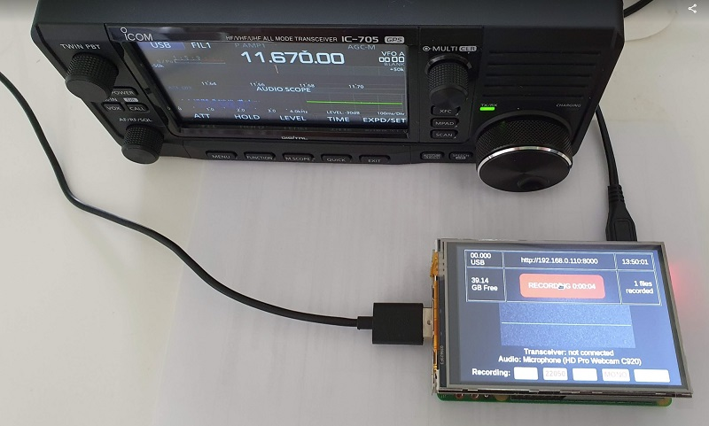
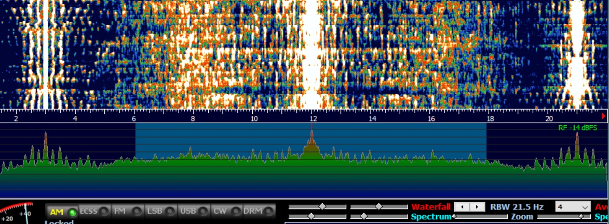
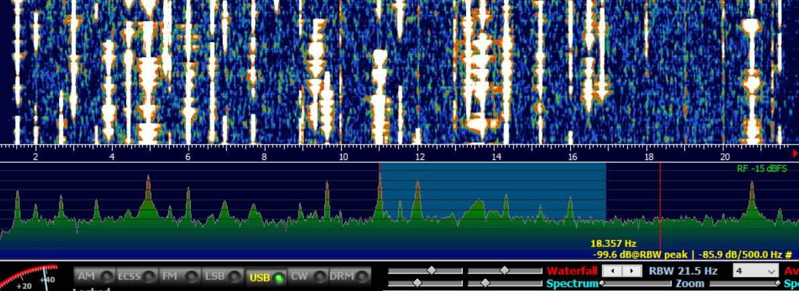

# RPi Ham Radio Recorder

I did application for making recordings "in the field" using the Icom IC-705 transceiver. In theory, other models, that can provide USB-audio IF output (IC-7300, etc) can also be supported. Internal Icom recorder can make only 8000KHz sample rate WAV files, that is not enough for many digital signals, that can be found on air (DRM, STANAG, even AM requires more than 8000s/r for a good quality). 

## Features

- IF recording from any Icom transceiver (or any other that can support USB Audio)
- Automatic frequency sync with a transceiver using CI-V
- Only one USB cable needed
- Background recording does not affect transceiver normal usage

Spectrum of the recorded signal (much better than internal recorder with 8000KHz sample rate can provide):

AM band:

CW:

## Usage

With a TFT screen:
- Configure Raspberry Pi browser in the Kiosk mode
- Set the address http://127.0.0.1:8000 to be opened on the browser automatically after Raspberry Pi boot

Headless (without a screen):
- Enable local WiFi Access Point on the Raspberry Pi
- Connect your smartphone  to this AP, use a smartphone browser with a http://raspberry_pi_address:8000

## Install

- Clone the repository to any folder: *git clone https://github.com/dmitryelj/RPi-HamRadioRecorder* 
- Add *sudo python3 /path-you-selected/recorder.py &* and *sudo python3 /path-you-selected/transceiver.py* & to the /etc/rc.local
- Enjoy :) Default recording path for files is Documents folder on the Raspberry Pi. **WinSCP** is recommended to get files remotely. 